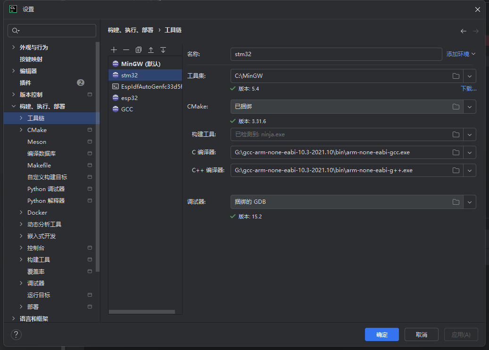
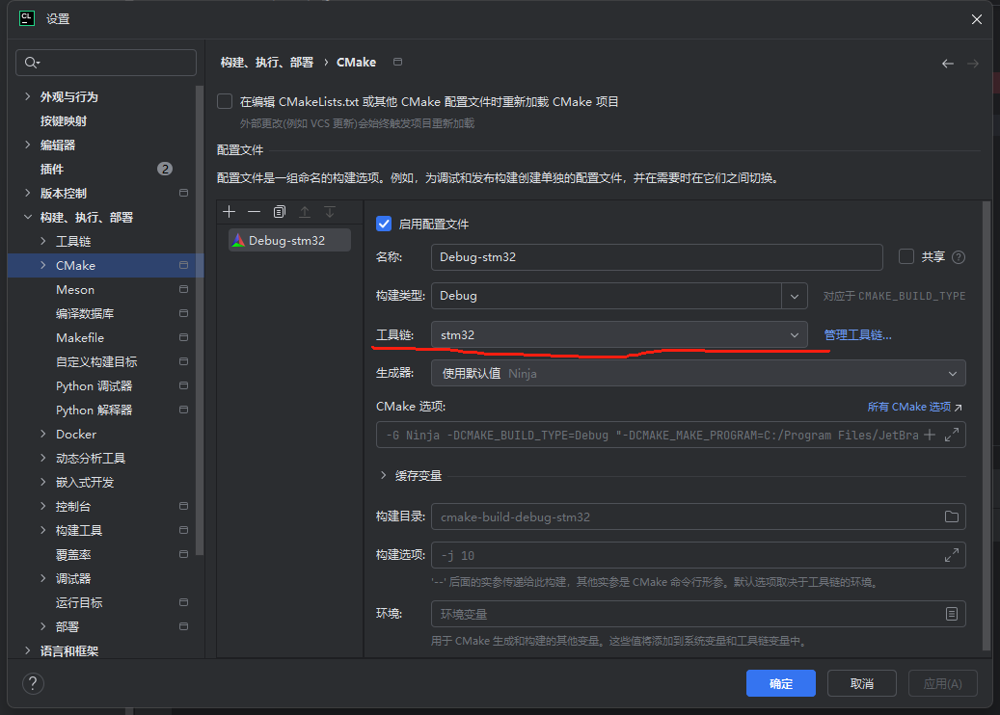
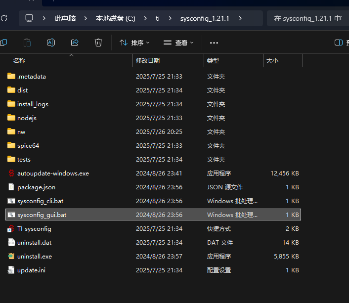
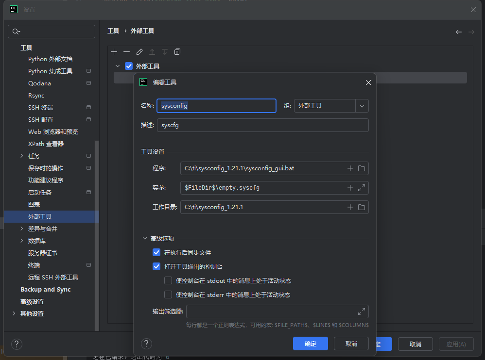
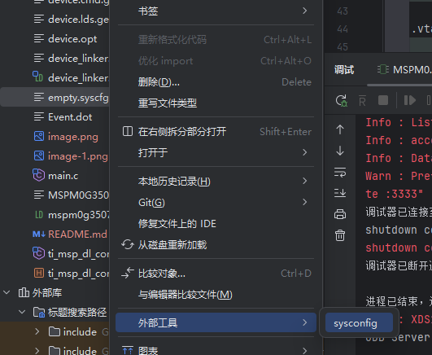
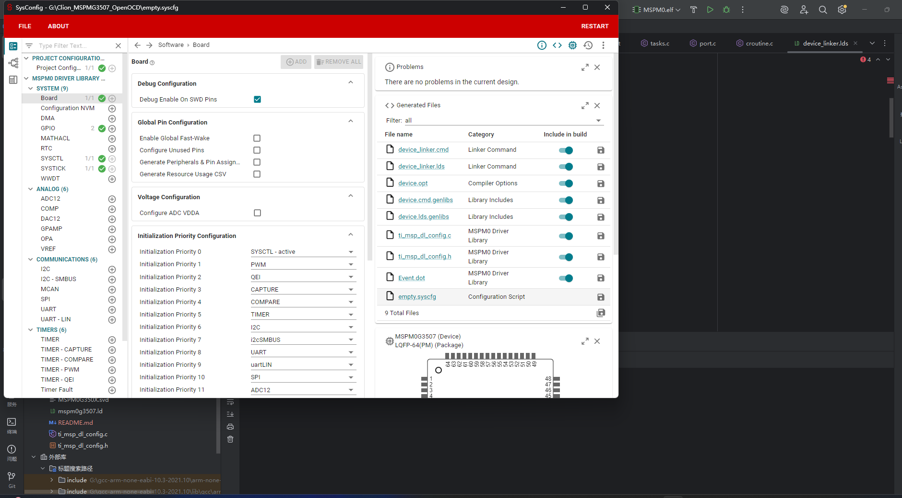
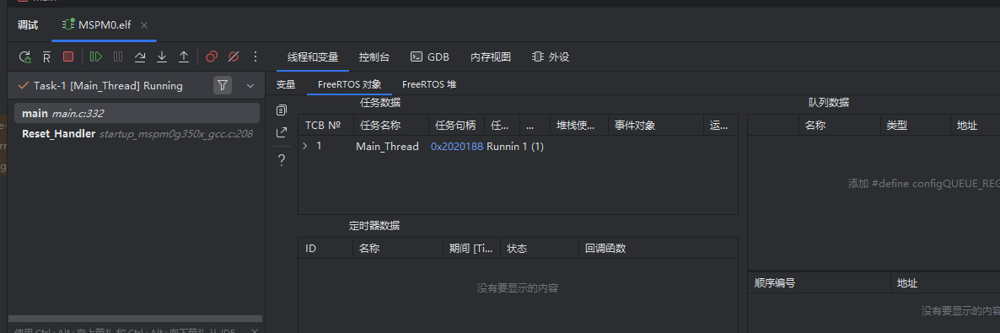

# TIMSPM0G3507 CLion 工程模板

[](https://opensource.org/licenses/MIT)
[](https://www.jetbrains.com/clion/)
[](https://www.freertos.org/)
[](https://openocd.org/)
[](https://www.ti.com/microcontrollers-mcus-processors/microcontrollers/mspm0-mixed-signal-microcontrollers/overview.html)

专为TI MSPM0G3507配置的CLion开发模板，集成FreeRTOS实时操作系统和图形化配置工具。


## 写在前面

相信打过电赛的同学一定饱受TI MSPM0G3507的折磨，`Keil`这种上世纪风格的IDE（不只是UI）,可以说几乎没有体验感，而TI自家的`CCS`,和`STM32CubeIDE`可以说是半斤八两，毕竟这俩都是从Eclipse魔改过来的，和`keil`相比也没多多少智能化设计，体验感上也只是从依托换到另依托。

而`CLion`作为JetBrains家族的IDE，专精C/C++开发，可以说是非常好的选择，近几年也对STM32开发做了很多适配，也收获了很多好评，它强大的代码补全、界面风格、各种插件、流畅性等众多优点吸引了一大批用户，本仓库就是为TI MSPM0G3507配置的CLion开发模板。

## ✨ 功能特性

### 核心功能
- 完整的CLion工程配置
- 预移植FreeRTOS v10.x
- 集成TI SysConfig图形化外设配置
- OpenOCD程序下载与调试

### 开发特性
- FreeRTOS专属调试功能：
  - 任务状态可视化
  - 队列/信号量监控
  - 栈使用情况分析
- 基于CMake的构建系统


### 工具链集成
- 支持ARM GCC工具链
- 支持XDS110调试器
#### 说明一下，目前只适配了XDS110调试器，本来想适配原生daplink，但是TI的芯片经常锁死，所以目前XDS110是最稳妥的方案，也欢迎各路大佬适配daplink。


## 🛠 硬件要求

### 开发硬件
- MSPM0G3507开发板
- 调试器（推荐J-Link/XDS110/XDS200）


### 软件环境
- [CLion](https://www.jetbrains.com/clion/) 2023.2或更新版本
- [ARM GCC工具链](https://developer.arm.com/tools-and-software/open-source-software/developer-tools/gnu-toolchain/gnu-rm)
- [TI SysConfig](https://www.ti.com/tool/SYSCONFIG)
- OpenOCD（注意，MSPM0G3507需要下载特定的open OCD版本，请参考[这里](https://github.com/HEBUST-NUEDC/openocd-mspm0/releases/tag/0.2)）

## 🚀 快速开始

### 1. 克隆仓库
```bash
git clone --recursive git clone https://gitee.com/xulijun_2003/MSPM0.git
cd mspm0g3507-clion-template
```


### 环境配置
因为同属arm开发，所以直接使用arm的gcc工具链即可，arm工具链的配置可以参考稚晖君之前发的文档[【优雅の嵌入式开发】](https://zhuanlan.zhihu.com/p/145801160)


主要是编译器的配置，配置完成后如图所示



选择Cmeke设置,选择工具链为配置好的STM32工具链




### SYSCONFIG配置

- 个人感觉sysconfig是TI开发工具链里体验感还算可以的软件，研究了一下在Clion中如何集成。

- 首先，打开sysconfig安装目录，找到这个sysconfig_gui.bat，并记住这个文件所在的目录。



- 打开Clion->设置->工具->外部工具，点击+号，添加一个外部工具，名称随便起，我这里就叫sysconfig，程序路径填写刚才记下的目录，注意这里的实参填`$FileDir$\empty.syscfg`，工作目录也如图填就可以，根据你安装的sysconfig目录自己做修改。设置完后点击确定即可。



- 然后，在Clion中打开工程，在文件目录中找到`empty.syscfg`,右键该文件，选择使用外部工具sysconfig。



- 正常的话就可以看到当前工程的sysconfig正常打开了，对工程的配置跟keil和CCS没有区别。



- 配置完后点击保存，回到工程就可以看到文件已经更新。

### 下载程序和调试跟Clion开发STM32一样,没有太大的区别

- 此工程适配了Clion对FreeRTOS的调试功能，可以在调试页面可以查看任务信息等



## 总结

- 其实总体和Clion开发STM32没有太大的区别，只是集成了sysconfig，另外对FreeRTOS的调试功能做了适配，可以方便的查看任务信息等。

- 文档写的比较烂，希望各位大佬多多包涵。

# 注意

- 区别于此前网上流传的Clion开发STM32环境，本模板为个人移植，没有官方支持，可能存在未知的问题，请谨慎使用，当然也欢迎大家提issue或者PR指出并且一起完善这套模板